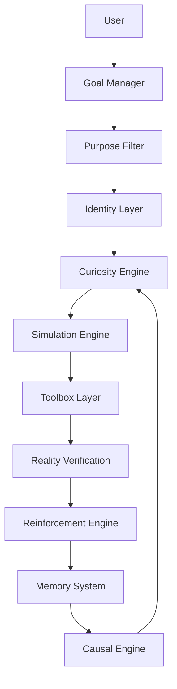

# IDC cavernicola
# Inventor Driven Cognition

> Purpose-Driven Cognitive Architecture for Autonomous Agents

IDC (Inventor Driven Cognition) is an experimental cognitive architecture designed around adaptive decision-making, causal learning, selective memory persistence and energy-constrained optimization.

Unlike architectures focused primarily on parameter scaling and context expansion, IDC investigates whether intelligent behavior can emerge from the interaction between:

- Purpose
- Identity
- Causal reasoning
- Selective memory
- Reality verification
- Energy constraints
- Reinforcement learning
- External knowledge systems

The architecture treats intelligence as a continuous optimization process operating under finite computational and energetic resources.

---

# Design Goals

## Primary Goals

- Build agents capable of pursuing objectives under uncertainty.
- Minimize unnecessary knowledge retention.
- Store only validated and reusable experiences.
- Convert observations into causal rules.
- Maintain identity consistency while allowing strategy evolution.
- Separate cognition from knowledge repositories.

---

## Non-Goals

IDC does not attempt to:

- Solve AGI.
- Replace modern LLM architectures.
- Store all available knowledge.
- Simulate omniscience.

Instead, it proposes a framework for orchestrating reasoning, experimentation, memory and adaptation.

---

# 🏛️ Arquitectura Monorepo (Turbo Structure)

El ecosistema de **IDC Cavernícola** se organiza en tres pilares independientes y complementarios:

```
IDC/ (Monorepo)
├── 🖥️ lab/       -> Consola & Puente Humano-Máquina (Frontend React/Vite & Telemetría en Vivo)
├── 🧠 core/      -> Corteza Cognitiva (El IDE Cavernícola en Python, Razonamiento Causal & Memoria)
└── 🦾 chasis/    -> Puente Ciberfísico & Hardware (Arduino, PLC, Sensores, Cámaras y Actuadores)
```

### 1. `lab/` — La Consola (Puente de Comunicación Humano-Máquina)
* **Propósito:** Interfaz de observabilidad y control bidireccional.
* **Función:** El humano supervisa en tiempo real los pulsos activos de reacción, el genoma de mutación y los recuerdos del agente; la máquina presenta sus hipótesis y solicita validaciones cuando la incertidumbre supera los umbrales seguros.

### 2. `core/` & `contracts/` — La Corteza Cognitiva (IDE Cavernícola en Python)
* **Propósito:** El cerebro autónomo regido por optimización energética y memoria selectiva.
* **Componentes:**
  * **Motor de Reacción por Pulsos ($O(1)$):** Reflejos sub-milisegundo en RAM ante picos críticos de sensores.
  * **Librerías de Realidad Plug-and-Play:** Carga modular de leyes físicas, térmicas, químicas o de sistemas (*"No robots químicos donde no se ocupan"*).
  * **Bóveda de Memoria Selectiva:** Distinción estricta entre *Recuerdos Hipotéticos* (conjeturas "¿y si...?") y *Recuerdos Lógicos Citables* (hechos empíricamente probados con hash criptográfico SHA256).
  * **Bucle de Tenacidad:** Persistencia inquebrantable que descarta errores en *Causal Trash* ("así no"), consulta observadores y muta la acción hasta resolver el reto.

### 3. `chasis/` — El Puente Ciberfísico (Hardware & Sensores)
* **Propósito:** La extensión tangible del agente hacia el mundo físico e industrial.
* **Componentes:**
  * Integración con microcontroladores (**Arduino, ESP32**) y automatización (**PLC, Modbus, CAN**).
  * Percepción en tiempo real: cámaras de visión computacional, sensores de corriente, temperatura, proximidad y LIDAR.
  * De aquí nacen las capacidades físicas del agente para interactuar y transformar su entorno real.

---


# Core Principles

## 1. Finite Resources

All systems operate under constraints:

```text
Energy
Time
Memory
Compute
Attention
```

Therefore:

```text
Learning Everything
≠
Optimal Strategy
```

---

## 2. Purpose-Driven Execution

Every operation must contribute toward a goal.

```text
Action
↓
Purpose Filter
↓
Accept or Reject
```

Purpose acts as a noise-reduction mechanism.

---

## 3. Causal Reasoning

IDC prioritizes causal relationships over correlations.

```text
A → B
```

does not imply:

```text
B → A
```

Every learned rule must include:

```text
Cause
Effect
Confidence
Replications
Conditions
```

---

## 4. Reality Supremacy

Simulation generates possibilities.

Reality validates them.

```text
Hypothesis
↓
Simulation
↓
Experiment
↓
Verification
```

Verified observations take precedence over internal predictions.

---

## 5. Selective Persistence

Memory is treated as a limited and valuable resource.

Persistence must be earned through validation.

Stored information includes:

- Procedures
- Causal rules
- Verified experiences
- Proven optimizations

---

## 6. Identity Persistence

Identity remains stable across sessions.

Identity defines:

```text
Who am I?
What matters?
What constraints must I respect?
```

Goals may change.

Strategies may change.

Identity changes slowly.

---

# Cognitive Layers

IDC defines five cognitive processing layers.

---

## Type 1 - Reactive Layer

Fast execution.

```text
Stimulus
↓
Response
```

Examples:

- Emergency actions
- Safety checks
- Resource monitoring

---

## Type 2 - Pattern Layer

Uses previous experiences.

```text
Current Situation
↓
Pattern Matching
↓
Candidate Action
```

Examples:

- Error recognition
- Recommendation systems

---

## Type 3 - Simulation Layer

Evaluates possible outcomes.

```text
State
↓
Future Projection
↓
Decision
```

Examples:

- Planning
- Resource allocation

---

## Type 4 - Exploratory Layer

Curiosity-driven exploration.

```text
Known A
+
Known B
↓
Possible C
```

Examples:

- Innovation
- Discovery
- Experimentation

---

## Type 5 - Consolidation Layer

Transforms observations into reusable knowledge.

```text
Experience
↓
Replication
↓
Rule
```

Examples:

- Learning procedures
- Operational optimization

---

# System Architecture



---

# Repository Structure

```text
IDC/
│
├── README.md
├── LICENSE
├── CHANGELOG.md
│
├── docs/
│   ├── architecture.md
│   ├── cognition.md
│   ├── memory.md
│   ├── reinforcement.md
│   ├── toolbox.md
│   └── metrics.md
│
├── core/
│   ├── cognitive_loop.py
│   ├── identity.py
│   ├── purpose_filter.py
│   ├── curiosity_engine.py
│   ├── simulation_engine.py
│   ├── causal_engine.py
│   ├── reinforcement_engine.py
│   ├── energy_manager.py
│   └── decision_engine.py
│
├── memory/
│   ├── short_term/
│   ├── episodic/
│   ├── procedural/
│   ├── causal/
│   ├── identity/
│   └── trash/
│
├── toolbox/
│   ├── physics/
│   ├── mathematics/
│   ├── probability/
│   ├── spacetime/
│   ├── coding/
│   ├── economics/
│   ├── biology/
│   └── internet/
│
├── plugins/
│   ├── filesystem/
│   ├── browser/
│   ├── search/
│   ├── sensors/
│   ├── robotics/
│   └── vision/
│
├── goals/
│   ├── active/
│   ├── completed/
│   └── archived/
│
├── rules/
│   ├── proposed/
│   ├── validated/
│   └── deprecated/
│
├── learning/
│   ├── rewards/
│   ├── penalties/
│   ├── confidence/
│   └── uncertainty/
│
├── experiments/
│   ├── prototypes/
│   └── simulations/
│
├── versions/
│   ├── v0.1/
│   ├── v0.2/
│   ├── v0.3/
│   └── history.json
│
└── legacy/
    ├── theories/
    ├── discoveries/
    ├── lessons/
    └── diaries/
```

---

# Toolbox Architecture

Knowledge repositories remain external to the cognitive core.

The cognitive engine queries them on demand.

---

## Plugin Interface

```python
class Plugin:

    name: str

    def query(
        self,
        request: dict
    ) -> dict:
        pass
```

---

## Example Query

```json
{
  "plugin": "physics",
  "operation": "gravity",
  "context": {}
}
```

Response:

```json
{
  "formula": "F = m * g",
  "confidence": 0.99
}
```

---

# Memory Architecture

## Short-Term Memory

Current operational context.

---

## Episodic Memory

Past events and observations.

```json
{
  "event":"deployment_failure",
  "timestamp":"..."
}
```

---

## Procedural Memory

Repeatable actions.

```json
{
  "procedure":"clear_cache",
  "success_rate":0.84
}
```

---

## Causal Memory

Validated causal relationships.

```json
{
  "cause":"persistent_cache",
  "effect":"faster_deployment",
  "confidence":0.91,
  "replications":82
}
```

---

## Causal Trash

Stores failures and rejected hypotheses.

Purpose:

```text
Prevent repeated mistakes.
```

---

# Reinforcement Learning Model

Reward function:

```text
Reward =
Success
+
Efficiency
+
Replication
+
Purpose Alignment
-
Energy Cost
-
Complexity
```

---

Agent objectives:

```text
Maximize:

Success
Adaptability
Learning Efficiency

Minimize:

Energy
Time
Complexity
```

---

# Energy Model

Energy is modeled as a finite resource.

```text
100 = Full Capacity
0   = Shutdown
```

---

Operational Modes:

```text
Energy > 20
    Exploration Mode

Energy <= 20
    Optimization Mode

Energy <= 5
    Survival Mode
```

---

# Cognitive Metrics

## IC - Curiosity Index

```text
IC =
new_questions
/
total_questions
```

Measures exploration rate.

---

## ICC - Causal Confidence Index

```text
ICC =
validated_rules
/
proposed_rules
```

Measures quality of causal reasoning.

---

## IR - Replication Index

```text
IR =
repeatable_successes
/
total_successes
```

Measures reproducibility.

---

## IA - Adaptation Index

```text
IA =
performance_improvement
/
time
```

Measures adaptation speed.

---

## II - Innovation Index

```text
II =
result
/
complexity
```

Measures optimization quality.

---

## IP - Purpose Alignment Index

```text
IP =
purposeful_actions
/
total_actions
```

Measures objective coherence.

---

# Versioning

Semantic versioning is used.

```text
Major.Minor.Patch
```

Examples:

```text
v1.0.0
v1.2.0
v1.2.3
```

Rules:

```text
Major
=
Architectural changes

Minor
=
New modules

Patch
=
Fixes and refinements
```

---

# Initial Implementation Roadmap

## Phase 1

Foundation

```text
Identity
Purpose Filter
Energy Manager
Memory Layer
```

---

## Phase 2

Reasoning

```text
Curiosity Engine
Simulation Engine
Causal Engine
```

---

## Phase 3

Learning

```text
Reinforcement Engine
Rule Extraction
Confidence Tracking
```

---

## Phase 4

Tool Integration

```text
Physics
Search
Filesystem
Browser
Robotics
```

---

## Phase 5

Autonomous Experimentation

```text
Goal Selection
Self-Evaluation
Adaptive Optimization
```

---

# IDC Unified CLI Reference

IDC includes a production command-line interface (`idc`) for autonomous causal reasoning, metabolic monitoring, and repository metacognition:

```bash
# 1. Escaneo estatico de AST, CI/CD y deuda tecnica
python -m core.cli scan

# 2. Ingesta de memoria episodica SQLite con deduplicacion
python -m core.cli ingest

# 3. Analiticas de deuda tecnica, grafos y densidad de complejidad
python -m core.cli metrics

# 4. Inspeccionar reglas causales aprendidas (A -> B verificadas)
python -m core.cli rules

# 5. Inspeccionar Causal Trash (hipotesis y acciones fallidas descartadas)
python -m core.cli trash

# 6. Inspeccionar traumas existenciales y cicatrices de hardware ciberfisico
python -m core.cli traumas

# 7. Monitor de telemetria de hardware anfitrion y estres metabolico
python -m core.cli telemetry

# 8. Resolver un objetivo cognitivo (con atajo causal a 0 tokens o consulta LLM)
python -m core.cli think "Acelerar compilacion de contenedores"
# Opciones avanzadas:
#   --force-llm       Fuerza consulta a LLM ignorando reglas previas
#   --recall-trauma   Despierta traumas historicos (por defecto dormidos para innovar sin miedo)
#   --ollama          Usa motor local Ollama en vez de Gemini Flash
```

---

# Project Status


```text
Status:
Research Architecture

Maturity:
Conceptual / Prototype

Domain:
Cognitive Systems
Artificial Intelligence
Autonomous Agents
```

## Summary

IDC proposes a cognitive architecture where:

```text
Intelligence
=
Purpose
+
Adaptation
+
Causal Learning
+
Selective Memory
+
Reality Verification
```

operating under:

```text
Finite Time
Finite Energy
Finite Resources
```

with the objective of maximizing useful learning and goal achievement rather than maximizing stored knowledge.


   brecha soluciones ds ---luis felipe duran salinas -ataca 3000
---

> *"La inteligencia no es tenerlo todo en la cabeza; es saber conectar, aprender y avanzar hasta su propósito."*
