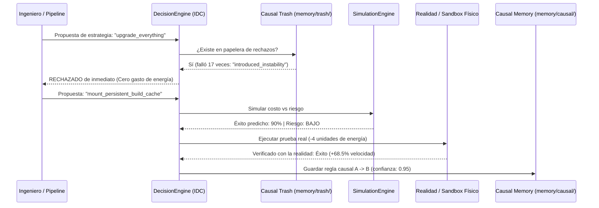

# Caso de Uso Práctico: Agente Autónomo de Optimización de CI/CD e IDE

Este ejemplo demuestra **dónde y por qué implementar la arquitectura IDC (Inventor Driven Cognition)** en un caso del mundo real: **un agente optimizador de compilación, empaquetado y despliegue continuo**.

---

## 🛑 El Problema con los Agentes Tradicionales
Cuando un agente convencional (ej. basado únicamente en llamadas a LLMs) intenta resolver problemas de build o rendimiento:
1. **Amnesia:** En cada ejecución empieza de cero, repitiendo diagnósticos lentos.
2. **Repetición de errores:** Si hace 2 días descubrió que ejecutar `upgrade_everything` rompía las dependencias, hoy vuelve a intentarlo porque no tiene memoria causal ni papelera de descarte.
3. **Despilfarro de recursos:** Hace llamadas masivas y costosas a APIs para decisiones mecánicas obvias.
4. **Alucinación de soluciones:** Supone que una solución funcionará sin contrastar su modelo mental contra la realidad física.

---

## ⚡ La Solución con IDC (Inventor Driven Cognition)

En este ejemplo ([`agent.py`](agent.py)), el agente funciona como un auténtico ingeniero/inventor pragmático:



---

## 🚀 Cómo Ejecutar el Ejemplo

Desde la raíz del proyecto:

```bash
uv run python examples/devops_autonomous_agent/agent.py
```

### Comportamiento observado:

1. **Caso 1 (Protección contra fallos conocidos):**  
   El agente evalúa `upgrade_everything`.  
   *Resultado:* El `DecisionEngine` detecta el patrón en `memory/trash/rejected.json` y **aborta la acción al instante sin quemar energía ni romper el build**.
2. **Caso 2 (Exploración, simulación y consolidación causal):**  
   El agente evalúa `mount_persistent_build_cache`.  
   *Resultado:* Pasa el filtro de propósito, la simulación proyecta bajo riesgo, se ejecuta en la realidad consumiendo 4 unidades de energía, comprueba la ganancia del 68.5% y **escribe una nueva regla causal en `memory/causal/`**. La próxima vez, la aplicará por reflejo directo.
